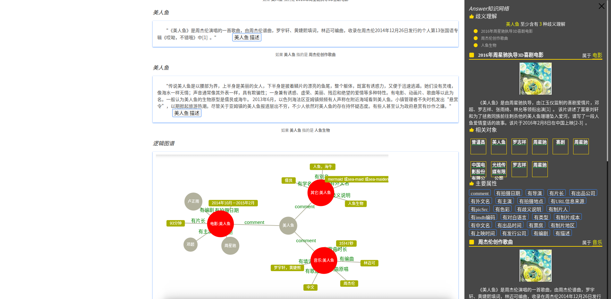

# Answer

> Answer-基于领域本体的问答系统服务端

## 调试开发
* 下载项目源码
* 使用 Eclipse、Idea 或其它 IDE 导入项目并设置好 maven、jdk 等配置
* 将 libs 下的 jar 包添加成项目 Library
* 项目中使用了 [HanLP](https://github.com/hankcs/HanLP) 进行分词，因此需要配置 HanLp 词典和模型路径
    * 下载 [HanLp Data](https://pan.baidu.com/s/1OZgHZiPd4GYmdoZT1u1MTA)，下载链接中的标准版 data-for-1.2.8-standard.zip 或 完整版data-for-1.2.8-full.zip 
    * 解压
    * 配置 hanlp.properties 文件 root = ”解压后的 data 的父目录“
* 运行 cn.lcy.answer.AnswerMain
* 通过浏览器访问 http://localhost:8080/answer?q=“问题”
## 调用 API
```
GET localhost:8080/answer?q=xxx
```

## Web 客户端
> answer-web-client 为 Answer 系统的 Web 前端

* 主页:


* 搜索结果:



answer-web-client 源码: [answer-web-client](https://github.com/YueHub/answer-web-client)

## 系统模块
[本体构建模块](https://github.com/YueHub/answer-ontology-construction)

[本体查询模块](https://github.com/YueHub/answer-ontology-query)

[语义解析模块](https://github.com/YueHub/answer-knowledge-analysis)

## 相关文档
* [简书](https://www.jianshu.com/nb/17523853)
* [个人博客](http://yuehub.gitee.io/categories/技术/项目/Answer-语义搜索/)

## License
[MIT License](https://github.com/YueHub/Answer/blob/master/LICENSE.md)
